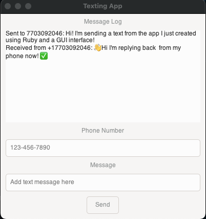

# SMS Application with Twilio and GTK

This project is a simple SMS application built using Ruby, GTK, and Twilio API. The application allows you to send and receive SMS messages using a graphical user interface. It leverages `ngrok` to expose your local server to the internet, enabling Twilio to communicate with your application.

## Screenshot


## Features

- Send SMS messages to any phone number.
- Receive incoming SMS messages and display them in the application.
- Utilize `ngrok` for easy local development and testing with Twilio.

## Requirements

- Ruby (version 2.0.0 or higher)
- GTK 3
- Twilio account with API credentials
- `ngrok` installed and configured

## Installation

1. **Clone the repository:**

   ```sh
   git clone https://github.com/JeremyDuncan/Ruby-GUI-Text-App.git
   cd ruby-gui
   ```

2. **Install the required gems:**

   ```sh
   bundle install
   ```

3. **Set up the `.env` file:**

   Create a `.env` file in the project root and add your Twilio and ngrok configuration:

   ```env
   TWILIO_ACCOUNT_SID='your_twilio_account_sid'
   TWILIO_AUTH_TOKEN='your_twilio_auth_token'
   TWILIO_PHONE_NUMBER='your_twilio_phone_number'
   NGROK_DOMAIN='your_ngrok_domain'
   NGROK_PORT=4567
   ```

4. **Ensure `ngrok` is installed:**

   - On macOS (using Homebrew):
     ```sh
     brew install ngrok/ngrok/ngrok
     ```

   - On Linux:
     - Download the appropriate package for your system from the [ngrok download page](https://ngrok.com/download).
     - Extract the downloaded file:
       ```sh
       unzip /path/to/ngrok-stable-linux-amd64.zip
       ```
     - Move the extracted `ngrok` binary to a directory in your PATH:
       ```sh
       sudo mv ngrok /usr/local/bin
       ```

5. **Install GTK 3 development libraries:**

   - On macOS (using Homebrew):
     ```sh
     brew install gtk+3
     ```

   - On Ubuntu/Debian:
     ```sh
     sudo apt-get update
     sudo apt-get install libgtk-3-dev
     ```

   - On Fedora:
     ```sh
     sudo dnf install gtk3-devel
     ```

## Usage

1. **Run the application:**

   Use the provided `run_text_app.sh` script to start the application. This script will start `ngrok` and the Ruby application.

   ```sh
   ./run_text_app.sh
   ```

   If you encounter permission issues, make the script executable:

   ```sh
   chmod +x run_text_app.sh
   ```

2. **Interacting with the application:**

   - Enter the phone number and message in the provided fields.
   - Click the "Send" button to send the message.
   - Incoming messages will be displayed in the "Received Messages" section.

## File Structure

- `main.rb`: Main application file.
- `Gemfile`: Specifies the Ruby gems required for the application.
- `Gemfile.lock`: Auto-generated file containing gem versions.
- `interface.glade`: Glade file defining the GTK interface.
- `run_text_app.sh`: Script to start `ngrok` and the Ruby application.
- `.env`: Environment variables for Twilio and `ngrok`.

## Troubleshooting

- If you encounter issues with `ngrok` or port forwarding, ensure no other process is using the specified port (`4567`). You can also check `ngrok` logs at `http://127.0.0.1:4040` to verify that requests are being forwarded correctly.

- On Linux, if you encounter issues with GTK or missing dependencies, ensure you have installed the necessary development libraries for your distribution.

- If you face permission issues when running the script, make sure it's executable:
  ```sh
  chmod +x run_text_app.sh
  ```

## Contributing

Contributions are welcome! Please fork the repository and submit a pull request with your changes.

## Contact

For questions or feedback, please contact [jeremy.duncan1984@gmail.com](mailto:jeremy.duncan1984@gmail.com).


Porfolio: [www.jeremy-duncan.com](https://www.jeremy-duncan.com)